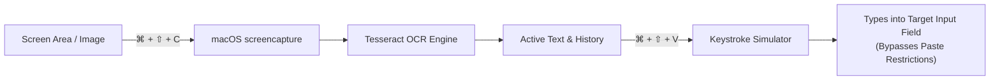

# macOS Copy-Paste Tool 🚀


A lightweight macOS menu bar application engineered to **bypass copy-paste restrictions** by extracting on-screen text via **OCR (Optical Character Recognition)** and typing it into any application through **simulated physical keystrokes**.

---

## 💡 The Problem & The Solution

| The Challenge | How This Tool Solves It |
| :--- | :--- |
| **Restricted Environments**: Exam browsers, remote desktop clients (Citrix, VMware, RDP), VM portals, and secure enterprise forms disable standard clipboard pasting (`⌘V`). | **Simulates Physical Keystrokes**: Instead of triggering a paste event, this tool types the text character-by-character as if you were physically typing on your keyboard. |
| **Unselectable Text**: Text embedded in videos, slides, locked PDFs, or web elements with disabled selection cannot be copied. | **On-Screen OCR**: Snaps an interactive crosshair selection of any area on your screen and extracts clean, editable text in milliseconds. |

---

## ✨ Features

- 📸 **Instant Screen OCR (`⌘ + ⇧ + C` or `⌘ + ⇧ + X`)**: Trigger macOS interactive screen capture to crop and extract text instantly from any part of your display.
- ⌨️ **Automated Keystroke Simulation (`⌘ + ⇧ + V`)**: Types captured or clipboard text at the hardware event level, seamlessly bypassing all clipboard paste restrictions.
- 🕒 **Recent Capture History**: Automatically stores your last 5 captures in the menu bar for quick 1-click recall and switching.
- ⏳ **Smart Focus Delay**: When clicking "Type Text" from the menu bar, a configurable 2-second countdown gives you time to switch focus to your target input field.
- 🛡️ **Modifier Key Collision Guard**: Buffers keystrokes until hotkeys (`Cmd`, `Shift`) are released, preventing accidental window closing or text selection.
- ⚡ **Adjustable Typing Speeds**: Toggle between **Fast** (0.01s), **Normal** (0.03s), and **Safe/Slow** (0.06s) typing intervals directly from the menu.
- 🔍 **Native Apple Silicon & Intel Support**: Automatically detects Homebrew Tesseract installations on both ARM64 (`/opt/homebrew`) and x86_64 (`/usr/local`).

---

## 🔄 Workflow



---

## ⌨️ Keyboard Shortcuts

| Shortcut | Action | Description |
| :--- | :--- | :--- |
| **`⌘ + ⇧ + C`** | **Capture Screen OCR** | Opens the interactive crosshair selection to extract text from your screen. |
| **`⌘ + ⇧ + X`** | **Alternative Capture** | Secondary capture hotkey (in case `⌘⇧C` conflicts with browser DevTools). |
| **`⌘ + ⇧ + V`** | **Simulate Typing** | Types the currently active text into the focused text area. |

---

## ⚙️ Installation & Setup

### 1. Prerequisites
- macOS Monterey (12+), Ventura (13+), Sonoma (14+), or Sequoia (15+)
- [Homebrew](https://brew.sh) package manager
- Python 3.9+

### 2. Install Tesseract OCR
Install the Tesseract OCR engine using Homebrew:
```bash
brew install tesseract
```

### 3. Clone Repository & Setup Environment
```bash
# Clone the repository
git clone https://github.com/bhaveshk25/macOS-copy-paste-tool.git
cd macOS-copy-paste-tool

# Create and activate a virtual environment
python3 -m venv venv
source venv/bin/activate

# Install dependencies
pip install -r requirements.txt
```

### 4. Run the Tool
```bash
python3 OCRBot/ocr_typing_bot.py
```
A **📋 OCR Bot** icon will appear in your macOS top menu bar.

---

## 🔒 Required macOS Permissions

Because this tool captures screen pixels, listens to global hotkeys, and generates synthetic keystrokes, macOS requires security permissions.

### 1. Accessibility (Required for simulated typing and hotkeys)
1. Open **System Settings** > **Privacy & Security** > **Accessibility**.
2. Click the **`+`** button (or toggle ON).
3. Add your terminal application (e.g., **Terminal**, **iTerm2**, or **VS Code**) and ensure the toggle is enabled.

### 2. Screen & System Audio Recording (Required for OCR screen selection)
1. Open **System Settings** > **Privacy & Security** > **Screen & System Audio Recording**.
2. Ensure your terminal application is enabled.

> [!NOTE]
> If you make changes to permissions, restart your terminal application for the changes to take effect.

---

## 📖 How to Use

1. **Capture Text**:
   - Press **`⌘ + ⇧ + C`** (or click the menu bar icon and select **Capture Text**).
   - Drag the crosshairs over any text on your screen.
   - You will see a macOS banner notification confirming the text was extracted.
2. **Type the Text**:
   - Click your cursor into the target input field where paste is restricted.
   - Press **`⌘ + ⇧ + V`** (or choose **Type Text** from the menu and click your field during the 2-second countdown).
   - Watch the tool type your text smoothly into the field!
3. **Switch Between Previous Captures**:
   - Click the menu bar icon and open the **🕒 Recent Captures** submenu to switch to any of your last 5 clips.

---

## 🗂️ Project Structure

```
macOS-copy-paste-tool/
├── OCRBot/
│   └── ocr_typing_bot.py     # Main menu bar application & typing engine
├── .gitignore                # Git ignore configuration
├── requirements.txt          # Python library dependencies
└── README.md                 # Project documentation
```

---

## 🛠️ Troubleshooting

- **Tesseract Not Found Alert**:
  Make sure you ran `brew install tesseract`. The bot automatically checks `/opt/homebrew/bin/tesseract` and `/usr/local/bin/tesseract`.
- **Text Not Typing in Target App**:
  Ensure your terminal has **Accessibility** permission enabled in macOS System Settings.
- **Screenshot Crosshair Doesn't Appear**:
  Ensure your terminal has **Screen Recording** permission enabled.

---

## 📄 License

This project is licensed under the [MIT License](LICENSE).
