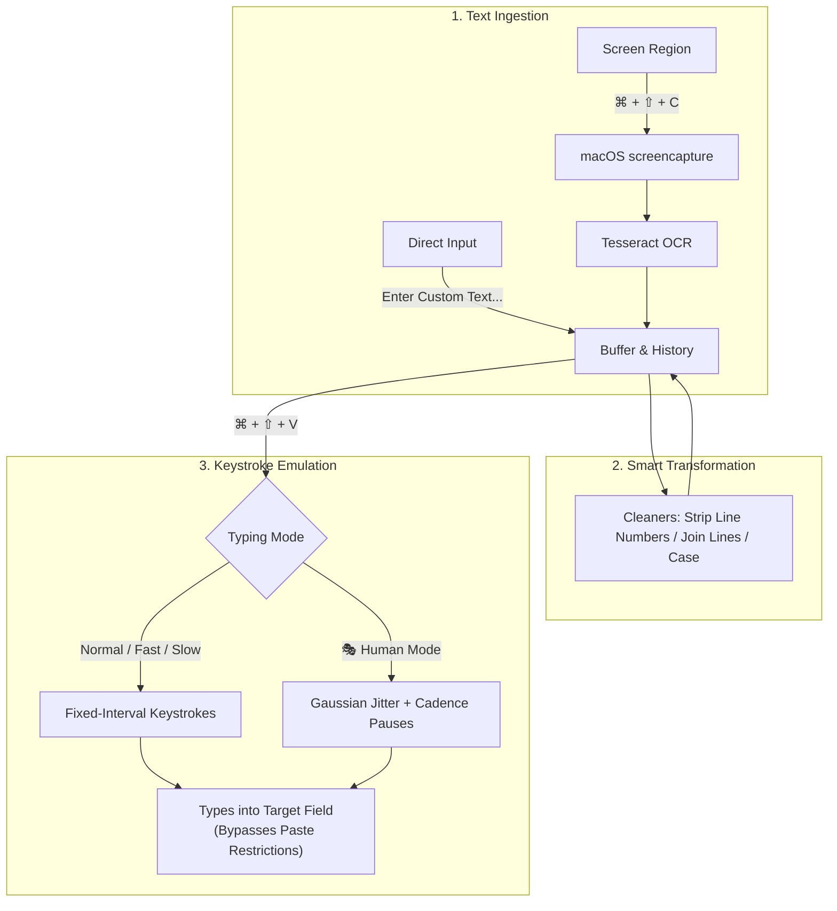

# macOS Copy-Paste Tool 🚀


A feature-packed macOS menu bar productivity application engineered to **bypass copy-paste restrictions** by extracting on-screen text via **OCR (Optical Character Recognition)** and typing it into any application through **simulated physical keystrokes**.

---

## 💡 The Problem & The Solution

| The Challenge | How This Tool Solves It |
| :--- | :--- |
| **Restricted Environments**: Exam portals, locked-down browsers, remote desktop clients (Citrix, VMware Horizon, RDP), and enterprise forms block standard clipboard pasting (`⌘V`). | **Simulates Physical Keystrokes**: Types character-by-character as hardware keystrokes, completely evading clipboard paste detection. |
| **Bot & Macro Detection**: Proctoring software checks for mechanical keystroke timing (unrealistic identical delays between characters). | **🎭 Natural / Human Typing Mode**: Introduces realistic Gaussian jitter (12–85ms) and natural cadence pauses after punctuation/spaces. |
| **Unselectable Text**: Text embedded in videos, slides, locked PDFs, or protected websites cannot be highlighted. | **📸 On-Screen OCR**: Snaps an interactive crosshair selection of any display region and extracts clean text in milliseconds. |
| **Messy OCR Artifacts & Code Line Numbers**: Copied code contains line numbers (`1 | `, `01. `), or OCR breaks sentences across awkward line wraps. | **🧹 Smart Cleaners**: One-click menu tools to strip code line numbers, join broken line wraps, collapse excess whitespace, and convert case. |

---

## ✨ Feature Suite

### 🎯 Core Capabilities
- 📸 **Instant Screen OCR (`⌘ + ⇧ + C` or `⌘ + ⇧ + X`)**: Snaps an interactive selection area to crop and extract text anywhere on your screen.
- ⌨️ **Automated Keystroke Simulation (`⌘ + ⇧ + V`)**: Types buffered text at the hardware event level, seamlessly bypassing all clipboard paste blocks.
- 🎭 **Natural / Human Typing Mode**: Emulates realistic human typing speed variations (jitter) to prevent detection by automated proctoring software.
- ✍️ **Enter Custom Text Modal**: Quick popup dialog (`rumps.Window`) to enter or paste custom text directly into the typing buffer without taking a screenshot.

### 🧹 Text Cleaners & Formatters
- **Fix Broken Linebreaks**: Automatically re-joins paragraphs that were awkwardly wrapped across lines by OCR.
- **Strip Code Line Numbers**: Regex-powered cleaner that strips prefixes like `1 | `, `01: `, `[12] `, or `>>> `.
- **Trim Excess Whitespace**: Removes trailing spaces and collapses redundant blank lines.
- **Case Converters**: Instant conversion to `UPPERCASE`, `lowercase`, or `Title Case`.

### 🖥️ Menu Bar & Workflow Controls
- 📊 **Live Buffer Statistics**: Real-time character count, word count, and line count displayed directly in the menu preview: e.g., `Current (142c, 24w, 3L): "..."`.
- 🕒 **Recent Capture History**: Stores your last 5 captures for instant 1-click switching and re-typing.
- ⏳ **Smart Focus Delay**: Configurable countdown (1s, 2s, 3s) when clicking from the menu bar to allow you to focus your target window.
- 🛡️ **Modifier Key Collision Guard**: Buffers keystrokes until modifier keys (`Cmd`, `Shift`) are released, preventing accidental OS shortcut collisions.
- 🔊 **Native macOS Sound Effects**: Playful, non-intrusive sound cues (`Tink` and `Pop`) on capture and typing completion (toggleable).
- 🔍 **Tesseract Auto-Detection**: Automatically detects Homebrew paths on both Apple Silicon (`/opt/homebrew`) and Intel (`/usr/local`).

---

## 🔄 Workflow



---

## ⌨️ Keyboard Shortcuts Reference

| Shortcut | Action | Description |
| :--- | :--- | :--- |
| **`⌘ + ⇧ + C`** | **Capture Screen OCR** | Opens the interactive crosshairs to capture text from your screen. |
| **`⌘ + ⇧ + X`** | **Alternative Capture** | Secondary capture hotkey (in case `⌘⇧C` conflicts with browser DevTools). |
| **`⌘ + ⇧ + V`** | **Simulate Typing** | Types the currently active text buffer into the focused text area. |

---

## ⚙️ Installation & Setup

### 1. Prerequisites
- macOS Monterey (12+), Ventura (13+), Sonoma (14+), or Sequoia (15+)
- [Homebrew](https://brew.sh) package manager
- Python 3.9+

### 2. Install Tesseract OCR
```bash
brew install tesseract
```

### 3. Clone Repository & Setup Environment
```bash
# Clone the repository
git clone https://github.com/bhaveshk25/macOS-copy-paste-tool.git
cd macOS-copy-paste-tool

# Create and activate a virtual environment
python3 -m venv venv
source venv/bin/activate

# Install dependencies
pip install -r requirements.txt
```

### 4. Run the Application
```bash
python3 OCRBot/ocr_typing_bot.py
```
A **📋 OCR Bot** icon will appear in your top macOS menu bar.

---

## 🔒 Required macOS Permissions

Because this tool captures screen pixels, listens to global hotkeys, and generates synthetic keystrokes, macOS requires security permissions:

### 1. Accessibility (Required for keystroke simulation and global hotkeys)
1. Open **System Settings** > **Privacy & Security** > **Accessibility**.
2. Click the **`+`** button (or toggle ON).
3. Add your terminal application (e.g., **Terminal**, **iTerm2**, or **VS Code**) and ensure the toggle is enabled.

### 2. Screen & System Audio Recording (Required for OCR screen selection)
1. Open **System Settings** > **Privacy & Security** > **Screen & System Audio Recording**.
2. Ensure your terminal application is enabled.

> [!NOTE]
> If you make changes to permissions, restart your terminal application for the changes to take effect.

---

## 📖 How to Use

1. **Capturing Text**:
   - Press **`⌘ + ⇧ + C`** (or click **📸 Capture Text** in the menu).
   - Drag the crosshair over any text on your screen.
   - A macOS notification and sound cue will confirm the text was captured and copied.
2. **Cleaning Text (Optional)**:
   - If copying code, select **`🧹 Clean & Transform`** > **`🔢 Strip Code Line Numbers`**.
   - If text has broken line wraps, select **`🔗 Fix Broken Linebreaks`**.
3. **Simulating Keystrokes**:
   - Place your cursor in the target input field.
   - Press **`⌘ + ⇧ + V`**.
   - The bot types out your text character-by-character!
4. **Using Natural / Human Mode**:
   - Select **`⚡ Typing Speed & Mode`** > **`🎭 Natural / Human (Jitter)`**.
   - The bot will vary keypress speeds and pause after punctuation, mirroring authentic human typing.

---

## 🗂️ Project Structure

```
macOS-copy-paste-tool/
├── OCRBot/
│   └── ocr_typing_bot.py     # Main menu bar app, OCR engine & typing simulator
├── .gitignore                # Git ignore configuration
├── requirements.txt          # Python library dependencies
└── README.md                 # Project documentation
```

---

## 🛠️ Troubleshooting

- **Tesseract Not Found Alert**:
  Make sure you ran `brew install tesseract`. The bot automatically checks `/opt/homebrew/bin/tesseract` and `/usr/local/bin/tesseract`.
- **Text Not Typing in Target App**:
  Ensure your terminal has **Accessibility** permission enabled in macOS System Settings.
- **Screenshot Crosshair Doesn't Appear**:
  Ensure your terminal has **Screen Recording** permission enabled.

---

## 📄 License

This project is licensed under the [MIT License](LICENSE).
