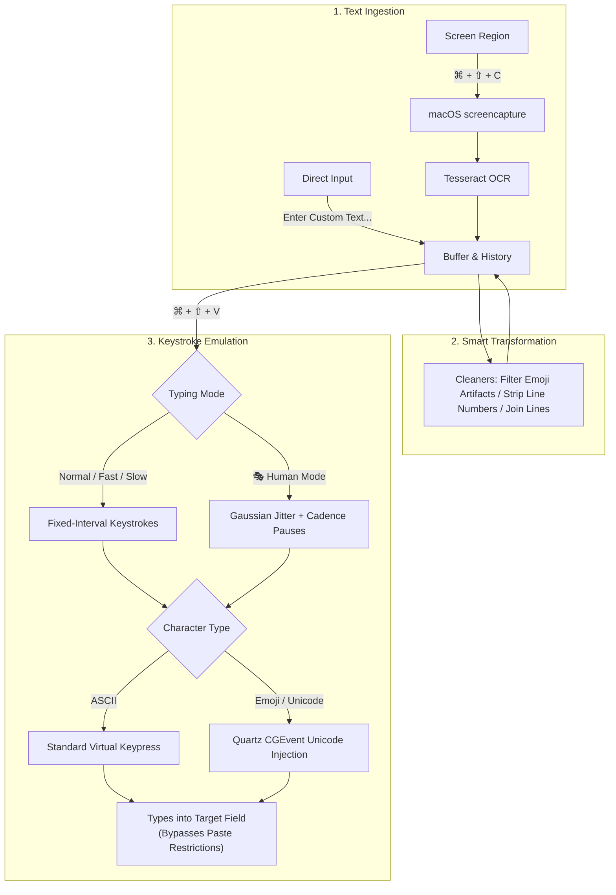

# VisionType 👁️


**VisionType** is a feature-packed macOS menu bar productivity application engineered to **bypass copy-paste restrictions** by extracting on-screen text via **OCR (Optical Character Recognition)** and typing it into any application through **simulated physical keystrokes**, with full support for **emojis**, **code**, and **multiline text**.

---

## 💡 The Problem & The Solution

| The Challenge | How VisionType Solves It |
| :--- | :--- |
| **Restricted Environments**: Exam portals, locked-down browsers, remote desktop clients (Citrix, VMware Horizon, RDP), and enterprise forms block standard clipboard pasting (`⌘V`). | **Simulates Physical Keystrokes**: Types character-by-character as hardware keystrokes, completely evading clipboard paste detection. |
| **Emoji & Symbol Corruption**: Standard keystroke emulators fail or type random gibberish when encountering emojis (`🚀`, `😊`, `❤️`). | **🚀 Native Quartz Unicode Keystrokes**: Injects UTF-16 surrogate pairs directly into the macOS event tap, typing real emojis smoothly into any field. |
| **Bot & Macro Detection**: Proctoring software checks for mechanical keystroke timing (unrealistic identical delays between characters). | **🎭 Natural / Human Typing Mode**: Introduces realistic Gaussian jitter (12–85ms) and natural cadence pauses after punctuation and spaces. |
| **Unselectable Text**: Text embedded in videos, slides, locked PDFs, or protected websites cannot be highlighted. | **📸 On-Screen OCR**: Snaps an interactive crosshair selection of any display region and extracts clean text in milliseconds. |
| **Messy OCR Artifacts & Line Numbers**: Copied code contains line numbers (`1 | `, `01. `), or OCR turns icons into garbage characters (`©`, `~`). | **🧹 Smart Cleaners**: One-click menu tools to strip code line numbers, filter OCR emoji artifacts, join broken line wraps, and collapse whitespace. |

---

## ✨ Full Feature Suite

### 🎯 Core Capabilities
- 📸 **Instant Screen OCR (`⌘ + ⇧ + C` or `⌘ + ⇧ + X`)**: Snaps an interactive selection area to crop and extract text anywhere on your screen.
- ⌨️ **Automated Keystroke Simulation (`⌘ + ⇧ + V`)**: Types buffered text at the hardware event level, seamlessly bypassing all clipboard paste blocks.
- 🚀 **Full Emoji & Unicode Support**: Seamlessly types emojis, accented characters, and non-ASCII symbols without corruption using CoreGraphics Quartz.
- 🎭 **Natural / Human Typing Mode**: Emulates realistic human typing speed variations (jitter) to prevent detection by automated proctoring software.
- ✍️ **Enter Custom Text Modal**: Quick popup dialog (`rumps.Window`) to enter or paste custom text directly into the typing buffer without taking a screenshot.

### 🧹 Smart Cleaners & Formatters
- **✨ Filter OCR Emoji Artifacts**: Cleans up random symbols (`©`, `®`, `~`, `|`) produced when Tesseract tries to interpret an emoji icon as Latin text.
- **🔗 Fix Broken Linebreaks**: Automatically re-joins paragraphs that were awkwardly wrapped across lines by OCR.
- **🔢 Strip Code Line Numbers**: Regex-powered cleaner that strips prefixes like `1 | `, `01: `, `[12] `, or `>>> `.
- **✂️ Trim Excess Whitespace**: Removes trailing spaces and collapses redundant blank lines.
- **🔠 Case Converters**: Instant conversion to `UPPERCASE`, `lowercase`, or `Title Case`.

### 🖥️ Menu Bar & Workflow Controls
- 📊 **Live Buffer Statistics**: Real-time character count, word count, and line count displayed directly in the menu preview: e.g., `Current (142c, 24w, 3L): "..."`.
- 🕒 **Recent Capture History**: Stores your last 5 captures for instant 1-click switching and re-typing.
- ⏳ **Smart Focus Delay**: Configurable countdown (1s, 2s, 3s) when clicking from the menu bar to allow you to focus your target window.
- 🛡️ **Modifier Key Collision Guard**: Buffers keystrokes until modifier keys (`Cmd`, `Shift`) are released, preventing accidental OS shortcut collisions.
- 🔊 **Native macOS Sound Effects**: Playful, non-intrusive sound cues (`Tink` and `Pop`) on capture and typing completion (toggleable).
- 🔍 **Tesseract Auto-Detection**: Automatically detects Homebrew paths on both Apple Silicon (`/opt/homebrew`) and Intel (`/usr/local`).

---

## 🔄 Workflow



---

## ⌨️ Keyboard Shortcuts Reference

| Shortcut | Action | Description |
| :--- | :--- | :--- |
| **`⌘ + ⇧ + C`** | **Capture Screen OCR** | Opens the interactive crosshairs to capture text from your screen. |
| **`⌘ + ⇧ + X`** | **Alternative Capture** | Secondary capture hotkey (in case `⌘⇧C` conflicts with browser DevTools). |
| **`⌘ + ⇧ + V`** | **Simulate Typing** | Types the currently active text buffer into the focused text area. |

---

## 📋 Menu Bar Walkthrough

Click **VisionType** in your top menu bar to access the control panel:

```
VisionType
├── Current (84c, 14w, 2L): "def calculate..."  <-- Live buffer stats & text preview
├── ─────────────────────────
├── 📸 Capture Text (⌘⇧C)                        <-- Triggers interactive screen selection
├── ⌨️  Type Text (⌘⇧V)                          <-- Starts typing buffer into focused app
├── ✍️  Enter Custom Text...                      <-- Opens dialog to input/paste text & emojis
├── ─────────────────────────
├── 🧹 Clean & Transform                         <-- Formatting submenu
│   ├── 🔗 Fix Broken Linebreaks                 <-- Joins words broken across line wraps
│   ├── 🔢 Strip Code Line Numbers               <-- Removes leading line numbers (1., 01:, >>>)
│   ├── ✨ Filter OCR Emoji Artifacts            <-- Cleans stray symbols from emoji scans
│   ├── ✂️  Trim Excess Whitespace                <-- Collapses blank lines & trailing spaces
│   ├── ─────────────────────
│   ├── 🔠 UPPERCASE                             <-- Converts text to UPPERCASE
│   ├── 🔡 lowercase                             <-- Converts text to lowercase
│   └── 🔤 Title Case                            <-- Converts text to Title Case
├── 🕒 Recent Captures                           <-- History submenu
│   ├── 1. def calculate_sum...                 <-- Click to make active
│   ├── 2. User authentication token...
│   ├── ─────────────────────
│   └── Clear History                            <-- Wipes recent captures
├── ⚡ Typing Speed & Mode                        <-- Speed & rhythm options
│   ├── ⚡ Fast (0.01s)
│   ├── ⏱️  Normal (0.03s) [Default]
│   ├── 🐢 Safe / Slow (0.06s)
│   ├── ─────────────────────
│   └── 🎭 Natural / Human (Jitter)              <-- Randomizes keystrokes (Anti-Bot)
├── ⏳ Menu Focus Delay                          <-- Time to click target window from menu
│   ├── 1 Second
│   ├── 2 Seconds [Default]
│   └── 3 Seconds
├── ─────────────────────────
├── 🔊 Sound Effects [✓]                         <-- Toggle audio feedback (Tink / Pop)
├── ℹ️  Keyboard Shortcuts                       <-- Help card
└── Quit                                         <-- Closes the application
```

---

## 📖 Real-World How-To Guides

### Scenario 1: Bypassing Paste Block in an Exam or Virtual Machine (Citrix / RDP)
1. Select the text you want to transfer, or press **`⌘ + ⇧ + C`** to crop and OCR it from another window.
2. If the exam checks for bot/macro activity, select **`⚡ Typing Speed & Mode`** > **`🎭 Natural / Human (Jitter)`**.
3. Click your mouse into the locked input box in the exam or VM window.
4. Press **`⌘ + ⇧ + V`**.
5. VisionType simulates authentic human typing character-by-character directly through keyboard events.

### Scenario 2: Handling Emojis & Special Symbols
- When text contains emojis (e.g. from clipboard or custom text), VisionType uses **CoreGraphics Quartz** to inject genuine Unicode events rather than ASCII keycodes, preserving emojis like `🚀`, `😊`, and `❤️` perfectly.
- If you OCR a screenshot containing an emoji icon and Tesseract produces a stray `©` or `~`, click **`🧹 Clean & Transform`** > **`✨ Filter OCR Emoji Artifacts`** to clean it instantly.

### Scenario 3: Copying Code from a YouTube Video or Presentation
1. Pause the video on the code you want.
2. Press **`⌘ + ⇧ + C`** and drag the selection rectangle over the code.
3. If the video displayed editor line numbers (e.g., `1 | `, `2 | `), click **`🧹 Clean & Transform`** > **`🔢 Strip Code Line Numbers`**.
4. Click into your code editor and press **`⌘ + ⇧ + V`**. Your clean, runnable code will be typed in!

---

## ⚙️ Installation & Setup on macOS

### 1. Prerequisites
- macOS Monterey (12+), Ventura (13+), Sonoma (14+), or Sequoia (15+)
- [Homebrew](https://brew.sh) package manager
- Python 3.9+

### 2. Install Tesseract OCR
```bash
brew install tesseract
```

### 3. Clone Repository & Setup Environment
```bash
git clone https://github.com/bhaveshk25/macOS-copy-paste-tool.git
cd macOS-copy-paste-tool

# Create and activate a virtual environment
python3 -m venv venv
source venv/bin/activate

# Install dependencies
pip install -r requirements.txt
```

### 4. Run VisionType
```bash
python3 OCRBot/ocr_typing_bot.py
```
A **VisionType** item will appear in your top macOS menu bar.

---

## 🔒 Required macOS Permissions

Because VisionType captures screen pixels, listens to global hotkeys, and generates synthetic keystrokes, macOS requires security permissions:

### 1. Accessibility (Required for keystroke simulation and global hotkeys)
1. Open **System Settings** > **Privacy & Security** > **Accessibility**.
2. Click the **`+`** button (or toggle ON).
3. Add your terminal application (e.g., **Terminal**, **iTerm2**, or **VS Code**) and ensure the toggle is enabled.

### 2. Screen & System Audio Recording (Required for OCR screen selection)
1. Open **System Settings** > **Privacy & Security** > **Screen & System Audio Recording**.
2. Ensure your terminal application is enabled.

---

## 🛠️ Troubleshooting

- **Tesseract Not Found Alert**:
  Make sure you ran `brew install tesseract`. VisionType automatically checks `/opt/homebrew/bin/tesseract` and `/usr/local/bin/tesseract`.
- **Text Not Typing in Target App**:
  Ensure your terminal has **Accessibility** permission enabled in macOS System Settings.
- **Screenshot Crosshair Doesn't Appear**:
  Ensure your terminal has **Screen Recording** permission enabled.
- **Running in Background**:
  To keep VisionType running in the background even after closing the terminal:
  ```bash
  nohup python3 OCRBot/ocr_typing_bot.py > /dev/null 2>&1 &
  ```

---

## 📄 License

This project is licensed under the [MIT License](LICENSE).
